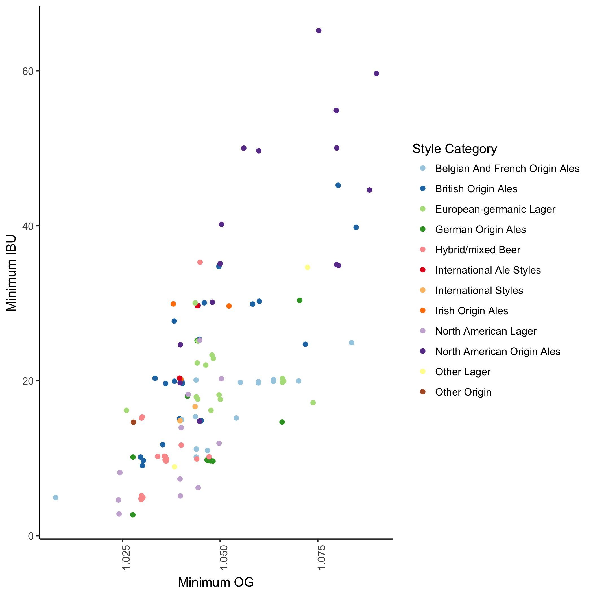

```{r setup, include=FALSE}
knitr::opts_chunk$set(echo = TRUE)
```

## Abstract for Homebrew Con 2018

### Subject:  
Recipe Formulation & Improvement – seminars designed to help the audience 
improve their homebrew or design the best beer possible.  


### Title:  
StyleSpace: the final beer frontier. To explore strange new styles, to seek out 
new flavors and new combinations, to boldly go where no beer has gone before.  

### Brief description (75 words, published):
Today's craft beer market provides a nearly infinite array of choices for beer lovers. As homebrewers we are always seeking something new and different that has never been made before. We present a web application allowing brewers to explore the beer StyleSpace by characteristics (gravity, ABV, SRM, IBU), ingredients, relatedness, or commercial examples, as curated by BreweryDB.com. Additionally, this visualization reveals empty space of underappreciated or undiscovered styles that perhaps no brewer has brewed before.

```{r}
abstract <- "Today's craft beer market provides a nearly infinite array of choices for beer lovers. As homebrewers we are always seeking something new and different that has never been made before. We present a web application allowing brewers to explore the beer StyleSpace by characteristics (OG, FG, ABV, SRM, IBU), ingredients, relatedness, or commercial examples, as currated by BreweryDB.com. Additionally, StyleSpace reveals empty spaces of underappreciated or undiscovered styles that perhaps no brewer has brewed before."
(wordcount <- length(unlist(strsplit(x = abstract, split = " "))))
```


### Detailed description (unlimited, for selection committee)
We have utilized the BreweryDB database of BJCP style guides, regional breweries, and beers along with data visualization tools to create an open source web application (currently in devlopment at https://github.com/warlicks/beeR) that any homebrewer or craft brewer can use to inspire their next creative brew. Users can specify the dimensions by which they would like to visualize this data and whether to present the data on a typical cartesian coordinate system or as a network graph, which represents the relatedness of styles and beers by the number of connections and proximity of the styles. Using interactive graphs users can zoom in on areas of interest and select beers or styles to get more info including links to brewery websites, BJCP, RateBeer, and Untapped. We hope this resource will be useful to both homebrewers and craft brewers and would like to use this opportunity to promote this tool to potential users and collaborators and to get feedback on additional visualizations or data that users would like.  

In our presentation we will walk through the available data and how to use the app. We will reveal several insights we have made in putting together this visualization. We will also walk through an expample of a brewer trying to brew a classic example of their favorite style and an example of a brewer trying to find a new and unexplored style, serving samples of each.




